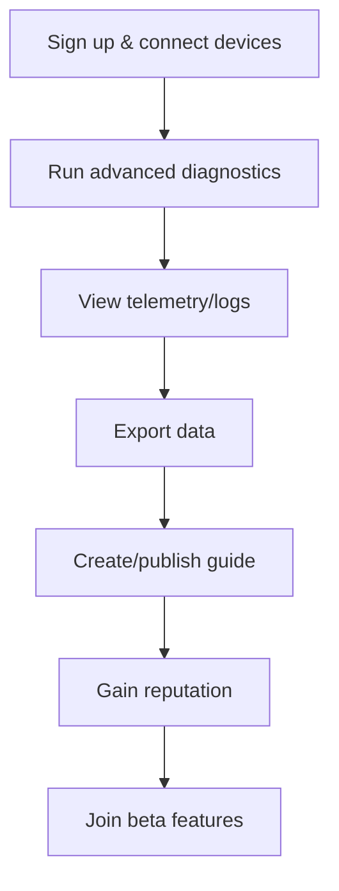

# UX Design Specification — Techare Ai Research Project

**Author:** Fola3
**Date:** 2025-12-29

---

*Initialized UX design workspace and discovered input documents.*

## Input Documents Discovered

- PRD: `_bmad-output/prd.md` ✓
- Product Brief: `_bmad-output/analysis/product-brief-Techare Ai Research Project-2025-12-22.md` ✓

---

## Executive Summary

Techare is a mobile‑first companion that helps homeowners diagnose, prevent, and repair smart‑home devices across brands. From a UX perspective, the product must be simple and trust‑building: fast diagnostics, clear next steps, hands‑free guided repair, and low‑friction escalation to vetted technicians.

### Project Vision

Empower non‑technical homeowners to confidently fix their devices using plain‑language diagnostics, step‑by‑step multimedia repair guides (video + voice), and proactive alerts that prevent failures.

### Target Users

- **Primary — John (Homeowner):** Low‑to‑moderate tech comfort, wants fast fixes and reassurance.
- **Power Users / DIY Enthusiasts:** Seek deeper telemetry, advanced controls, and contribution tools.
- **Technicians / Repair Shops:** Use job cards, diagnostics, and parts lists to increase efficiency.
- **Support / Admins:** Triage incidents, review diagnostics, and manage content/moderation.

### Key Design Challenges

- Communicating diagnostic results clearly without causing alarm (explainable confidence scores).
- Creating safe, low‑risk guided repair flows (safety checks, rollback, escalation).
- Preserving offline functionality (cached guides, buffered telemetry sync).
- Minimizing cognitive load during repairs (short steps, visual cues, voice prompts).
- Handling multi‑brand device variety while keeping the UX consistent.

### Design Opportunities

- Hands‑free voice guidance + short video clips for each repair step (higher success rate).
- Prefilled technician job cards with diagnostics & parts to reduce friction for escalation.
- Progressive disclosure: start with plain summary, allow power users to dig into logs/telemetry.
- Actionable predictive alerts that propose immediate remedial steps (parts + guided steps).
- Community validated guides surfaced by device & failure type.

---

*Saved and updated by UX workflow (stepsCompleted: [1, 2]).*

**Next:** Choose [A] Advanced Elicitation, [P] Party Mode, or [C] Continue to Step 3 (Core Experience).

## Core User Experience

### Defining Experience

The single most important user action is: **diagnose a device and complete a guided repair**. The core loop is: Diagnose → Suggested Repair or Preventive Action → Follow Step‑by‑Step Guided Repair (video + voice) → Confirm Repair (device health check). Success is measured by first‑time repair confirmation and reduced MTTR.

### Platform Strategy

- **Mobile‑first (React Native)** — primary interaction is touch with optional voice control for hands‑free repair.  
- **Offline‑first:** cache guides and assets locally; buffer telemetry and sync reliably when online.  
- **Real‑time & Push:** MQTT for telemetry ingestion; APNs/FCM for critical alerts and reminders.

### Effortless Interactions

- **One‑tap Diagnose:** Single entry point to run checks and surface simple plain‑language results.  
- **Short, focused steps:** Micro‑steps with a short video/voice prompt per step to reduce cognitive load.  
- **Prefilled escalation:** One‑tap book technician with prefilled diagnostic summary and parts list.  
- **Progressive disclosure:** Start with an actionable summary; allow power users to view detailed telemetry and logs.

### Critical Success Moments

- **First successful guided repair** (user confirms + device health OK) — major retention trigger.  
- **Actionable predictive alert** that leads to preventive action and avoids a failure.  
- **Seamless escalation:** Technician accepts job with all context and parts prefilled.  
- **First‑time setup success:** Device onboarding and initial diagnostic succeed without help.

### Experience Principles

- **Empathy & Clarity:** Explain problems in plain language and avoid alarmism.  
- **Safety‑first:** Always include safety checks and rollback options.  
- **Low friction:** Minimize steps for primary actions (diagnose → repair).  
- **Trust & Transparency:** Show confidence scores and explain reasoning briefly.

---

*Saved and updated by UX workflow (stepsCompleted: [1, 2, 3]).*

**Next:** Choose [A] Advanced Elicitation, [P] Party Mode, or [C] Continue to Step 4 (Emotional Response).

## Desired Emotional Response

### Primary Emotional Goals

- **Confident & Empowered:** Users should feel confident they can diagnose and fix their devices with clear guidance.  
- **Reassured & Calm:** The app should reduce anxiety around repairs with safety checks and non‑alarming language.  
- **In Control:** Users should feel they have agency (undo, rollback, request help) and clear next steps.  
- **Accomplished & Trusted:** Successful repairs should create a sense of accomplishment and trust in the product.

### Emotional Journey Mapping

- **Discovery:** Curious and hopeful — clear onboarding and immediate value proposition.  
- **Diagnosis:** Informed and reassured — present plain‑language summary with confidence indicators.  
- **Repair Flow:** Supported and focused — short actionable steps, calming tone, optional hands‑free voice.  
- **Completion:** Accomplished and relieved — confirm repair with device health check and celebratory acknowledgement.  
- **Failure / Escalation:** Reassured and guided — provide rollback, next steps, and quick escalation options without blame.

### Micro‑Emotions

- Confidence vs. Confusion — prevent confusion with clear progressive disclosure.  
- Trust vs. Skepticism — surface explainability and confidence scores to build trust.  
- Calm vs. Anxiety — use reassuring copy and visual cues during risky steps.  
- Accomplishment vs. Frustration — acknowledge progress and celebrate small wins.  
- Belonging vs. Isolation — connect users to community guides and vetted technicians when helpful.

### Design Implications

- Use plain‑language summaries first, with optional expandable technical details for power users.  
- Microcopy and tone should be reassuring and action‑oriented.  
- Provide confidence metrics and short explanations for diagnostic suggestions.  
- Safety checks and rollback paths must be clear and easily accessible at each critical step.  
- Design visual cues (progress bar, step numbers, short videos) to reduce cognitive load; ensure accessible color contrast and voice support.  
- Celebratory feedback on completion (subtle animation + confirmation) to reinforce accomplishment.

### Emotional Design Principles

- **Empathy‑first:** Prioritize user feelings in every flow; assume anxiety and design to reduce it.  
- **Clarity over cleverness:** Choose clear, simple language and interactions.  
- **Guardrails & agency:** Provide safety nets and explicit user control.  
- **Celebrate progress:** Acknowledge steps and repair success to build retention.  
- **Transparent reasoning:** Always show why a diagnostic suggestion was made in brief terms.

---

*Saved and updated by UX workflow (stepsCompleted: [1, 2, 3, 4]).*

**Next:** Choose [A] Advanced Elicitation, [P] Party Mode, or [C] Continue to Step 5 (Inspiration).

## UX Pattern Analysis & Inspiration

### Inspiring Products Analysis

- **iFixit / Repair Guides:** Extremely practical, step‑by‑step instructions, clear tooling lists, and community‑contributed guides—great model for the guided‑repair UX and parts lists.  
- **Apple / Nest onboarding:** Simple, immediate value onboarding (device discovery + immediate status), and trust signals—good model for frictionless pairing and first‑time success.  
- **YouTube / Short video platforms:** Short, focused how‑to clips that communicate visually in seconds—useful for short repair step videos.  
- **Airbnb / Uber (prefilled job cards):** Prepopulated, contextual job cards and simplified booking flows that reduce friction—model for technician booking & prefilled diagnostic cards.  
- **StackExchange / Reddit (community):** Searchable, categorized community knowledge and reputation signals—model for community guides and moderation.

### Transferable UX Patterns

- **One‑tap action & immediate value:** Run a diagnostic from a single tap and surface an actionable summary.  
- **Micro‑videos per step:** Short video + optional voice per repair step to reduce cognitive load and increase success.  
- **Progressive disclosure:** Plain summary up front with expandable technical detail for power users.  
- **Prefilled escalation flows:** Auto‑populate job cards with diagnostics and parts to reduce booking friction.  
- **Community validation & reputation:** Surface highest quality community guides with visibility into author reputation and moderator flags.

### Anti‑Patterns to Avoid

- **Dense technical text as primary UI:** Avoid long, jargon‑heavy explanations that confuse homeowners.  
- **Forced sign‑up before value:** Don't require account creation before showing immediate diagnostic value.  
- **Alarmist language / fear‑based alerts:** Avoid causing panic—present confidence & suggested next steps gently.  
- **Overloaded dashboards:** Avoid dumping raw telemetry on novice users; use progressive reveal instead.

### Design Inspiration Strategy

- **Adopt:** One‑tap diagnostics, micro‑videos for steps, prefilled booking flows, plain defaults with expandable detail.  
- **Adapt:** Short video + voice guidance tailored to specific device classes (camera, speaker, thermostat).  
- **Avoid:** Requiring sign‑up for basic diagnosis, alarmist phrasing, and raw telemetry dumps for novice users.

---

*Saved and updated by UX workflow (stepsCompleted: [1, 2, 3, 4, 5]).*

**Next:** Choose [A] Advanced Elicitation, [P] Party Mode, or [C] Continue to Step 6 (Design System).

## Design System Foundation

### 1.1 Design System Choice

**Choice:** Themeable System (practical foundation built on a React Native component library + design tokens + Storybook).

### Rationale for Selection

- **Speed + quality:** Leverages proven, accessible components to ship fast while letting us apply a distinct brand through tokens.
- **Team & timeline fit:** Smaller design/dev team can iterate quickly without building every component from scratch.
- **Accessibility & consistency:** A tokenized system with Storybook helps maintain WCAG standards and consistent behavior across device classes.

### Implementation Approach

- **Design tokens:** Define semantic tokens (colors, spacing, typography, radii, elevation) managed with Style Dictionary and versioned in the repo.
- **Component library:** Build a small, focused library of custom components for Techare (RepairStep, DiagnosticSummary, JobCard, PartsList, MediaStep, VoiceControl, Toasts) on top of a stable base (e.g., React Native Paper / UI Kitten or a minimal custom foundation).
- **Documentation & tooling:** Ship Storybook (React Native Storybook) and a Figma component library synchronized with tokens for designers and engineers.
- **Theming & dark mode:** Support theme tokens (light/dark/high-contrast) and runtime theme switching; ensure responsive and adaptive layouts for phone sizes.

### Customization Strategy

- **Brand tokens:** Map brand palette (trustworthy blues/greens, calm neutrals) to semantic tokens (background.surface, accent.primary, warn, success).
- **Component variants:** Provide a small set of themeable variants (primary, secondary, ghost) and state guidelines (disabled, loading, success, error).
- **Accessibility:** Target WCAG AA for color contrast, large tap targets (>=44px), adjustable font sizes, and screen‑reader labels for all interactive components.
- **Motion & microinteractions:** Subtle, short animations (200–350ms) for progress and completion; no jarring transitions during repair steps to preserve focus.

### Key Deliverables & Next Steps

- Tokens repository (`/packages/design-tokens`) with JSON output for iOS/Android/Web
- Storybook with initial component set and usage docs
- Figma library synced with tokens and component specs
- Accessibility checklist + automated visual tests (Chromatic/Percy or similar)
- Initial component backlog prioritized by UX critical path (RepairStep, DiagnosticSummary, MediaPlayer, JobCard)

---

*Saved and updated by UX workflow (stepsCompleted: [1, 2, 3, 4, 5, 6]).*

## 2. Core User Experience

### 2.1 Defining Experience
**One‑tap Diagnose → Actionable Result → Guided Repair**  
Users open Techare, tap a single prominent Diagnose button for a device, see a plain‑language diagnostic summary with a confidence score and recommended action, and—if needed—start a bite‑sized, multimedia guided repair (short video + voice cues) that completes the repair with an automated health check at the end.

### 2.2 User Mental Model
- Users expect diagnosis to be fast, simple, and authoritative: “Tell me what’s wrong and what to do next.”  
- Non‑technical users want clear steps and reassurance; power users want telemetry & logs.  
- They think in outcomes (device works) not processes (logs/metrics), so the UI must prioritize action and clear success signals.

### 2.3 Success Criteria
- First‑time guided repair success rate ≥ X% (target to be defined with data) ✅  
- Time‑to‑repair median under 20 minutes for simple fixes ✅  
- % of diagnoses that result in a clear next action (repair, preventive step, or escalate) ≥ 95% ✅  
- Reduction in technician dispatch rate for common failures by Y% ✅  
- Positive post‑repair NPS and completion rate of the repair flow

### 2.4 Novel vs. Established Patterns
- Mostly uses established, familiar patterns (one‑tap action, step‑by‑step guides).  
- Novel elements: explainable confidence scores and integrated hands‑free (voice + micro‑video) guidance tailored to device class — these are distinctive, but easy to teach through micro‑copy and short in‑flow hints.

### 2.5 Experience Mechanics
1. Initiation:
  - Entry: Device detail or home screen has a prominent **Diagnose** CTA (one tap).  
  - Permission/timeouts: System asks for necessary permissions (network, device pairing) if needed.

2. Interaction:
  - System runs tests (passive telemetry + optional active tests).  
  - Show a concise result card: plain summary, confidence score, recommended action(s), and estimated effort/time.  
  - If repair needed: "Start Repair" CTA launches an ordered sequence of micro‑steps (video clip + voice snippet per step).

3. Feedback:
  - Step completion feedback & progress bar, inline safety checks and undo/rollback where applicable.  
  - Midflow checks if user needs help (offer chat or escalate to technician).

4. Completion:
  - Run a post‑repair health check; show final status and celebratory confirmation.  
  - Offer optional feedback, shareable repair receipt, and a prefilled technician job card if repair failed.

---

*Saved and updated by UX workflow (stepsCompleted: [1, 2, 3, 4, 5, 6, 7, 8]).*

## Visual Design Foundation

### Color System

**Direction:** Calm, trust‑building palette with a strong primary color for action, supportive teals for reassurance, and clear semantic tokens for success/warn/error.

- **Semantic tokens:** background.surface, background.surface-2, text.primary, text.secondary, accent.primary, accent.secondary, success, warning, error, neutral.
- **Suggested palette:**
  - accent.primary: **Techare Blue** #0A74DA (trust, calls-to-action)
  - accent.secondary: **Teal** #0AA88F (reassurance, confirmations)
  - success: #2E7D32
  - warning: #FFB300
  - error: #D32F2F
  - background.surface: #FFFFFF
  - background.surface-2: #F6F7F9
  - text.primary: #0F1724
  - text.secondary: #667085

**Notes:** Tokenize all colors and verify WCAG AA contrast across themes (light/dark/high‑contrast). Provide a color visualizer for quick checks and an exportable palette for Figma/Storybook.

### Typography System

**Tone:** Friendly, modern, and readable. Prioritize legibility for non‑technical users while supporting dense telemetry views for power users.

- **Primary typeface:** Inter (variable). Fallbacks: system fonts (SF/Roboto). Use variable font for weight-range flexibility.
- **Type scale (base 16px):**
  - h1: 32px / 40px lh
  - h2: 24px / 32px lh
  - h3: 20px / 28px lh
  - h4: 16px / 24px lh
  - body: 16px / 24px lh
  - small: 14px / 20px lh

**Accessibility:** Support dynamic type / font-size scaling, strong contrast, and sufficient line heights for readability.

### Spacing & Layout Foundation

- **Base spacing unit:** 8px (scale: 4, 8, 12, 16, 24, 32, 40, 48)
- **Mobile layout:** single column flow with 16px horizontal page margins, 8–16px between micro‑components
- **Grid & responsive:** Use a flexible column system for larger screens (e.g., 4–12 cols for tablet/web) but default to single‑column for phone sizes
- **Touch targets:** Minimum 44px (recommended 48px) with generous hit areas for repair flows

### Accessibility Considerations

- WCAG AA color contrast as baseline; test critical flows for AAA where feasible
- Avoid conveying meaning with color alone; include icons/text labels
- Full screen‑reader labeling and predictable focus order
- Respect prefers‑reduced‑motion and offer reduced/shortened animations
- Test color blindness permutations and ensure token fallbacks

### Deliverables & Next Steps

- Exportable **design tokens** (Style Dictionary) with JSON outputs for iOS/Android/Web (`/packages/design-tokens`)
- **Figma library** with token syncing and component specs
- **React Native Storybook** with usable component examples and visual tests
- **Color visualizer** HTML for quick theme checks and accessibility previews
- Accessibility checklist + automated visual tests (Chromatic/Percy)

---

*Saved and updated by UX workflow (stepsCompleted: [1, 2, 3, 4, 5, 6, 7, 8]).*

## Design Direction Decision

### Design Directions Explored

1. **Calm & Trusted (Direction 1)** — Clean, minimal layouts; strong primary action color; emphasis on clarity and trust signals for homeowners. Ideal for achieving fast adoption and reducing anxiety during repairs.

2. **Warm & Reassuring (Direction 2)** — Softer palette, friendly illustrations, and larger imagery to convey empathy during risky flows. Best for users who need emotional reassurance.

3. **Technical & Data‑Rich (Direction 3)** — Denser information hierarchy with on‑demand telemetry and logs for power users and technicians. Best used for technician-facing flows and advanced settings.

### Chosen Direction

**Chosen Direction:** Calm & Trusted (Direction 1)

**Rationale:** This direction aligns with the primary user (homeowners) and the core product goal: helping non‑technical users quickly diagnose and repair devices with confidence. It pairs well with our design tokens (Techare Blue + Teal), supports high legibility for all ages, and simplifies the guided repair flows where calm clarity matters most.

### Implementation Approach

- Produce 6–8 HTML mockups showcasing the chosen direction and two alternates as comparisons (`{output_folder}/ux-design-directions.html`).
- Use Storybook to implement the primary components in the chosen visual style (RepairStep, DiagnosticSummary, JobCard, MediaPlayer).
- Sync Figma tokens and components with Storybook and the design tokens package.
- Run quick usability checks with 5 representative users to validate clarity for the diagnose/repair flow.

### Deliverables & Next Steps

- `ux-design-directions.html` — interactive showcase (6–8 variations + comparison tools)
- Storybook + initial component stories for the chosen direction
- Figma library with token sync and component specs
- Usability test plan and a small initial panel of testers

---

*Saved and updated by UX workflow (stepsCompleted: [1, 2, 3, 4, 5, 6, 7, 8, 9]).*

## User Journey Flows

### John — Homeowner (Success Path)

**Goal:** Diagnose and repair a device quickly and confidently.

```mermaid
flowchart TD
    A[Push alert: device offline] --> B[Open Techare app]
    B --> C[Add device (scan/manual)]
    C --> D[Opt into telemetry]
    D --> E[Run diagnostics]
    E --> F[Show plain-language result]
    F --> G[Offer guided repair (video+voice)]
    G --> H[User follows steps]
    H --> I[Confirm repair]
    I --> J[Health check + log repair]
```

### John — Edge Case / Failure Recovery

**Goal:** Recover from a failed repair step or escalate to support.

```mermaid
flowchart TD
    A[Guided repair step fails] --> B[Show rollback/safety instructions]
    B --> C[Quick troubleshooting checks]
    C --> D[Offer instant help (chat/call)]
    D --> E[Prefill diagnostic summary]
    E --> F[Book technician if unresolved]
    F --> G[Job scheduled]
```

### DIY Enthusiast — Power User & Contributor

**Goal:** Access advanced diagnostics and contribute community guides.



### Journey Patterns

- **Progressive disclosure:** Start simple, allow deeper exploration for power users.
- **Guided flows:** Step-by-step repair and onboarding with clear feedback.
- **Escalation paths:** Always provide a way to get help or escalate.
- **Prefilled actions:** Reduce friction by auto-filling job cards and summaries.

### Flow Optimization Principles

- Minimize steps to value (fastest path to repair or help)
- Clear feedback and progress at every step
- Reduce cognitive load with micro-steps and visual cues
- Robust error recovery and support escalation
- Delight through accomplishment and positive feedback

---

*Saved and updated by UX workflow (stepsCompleted: [1, 2, 3, 4, 5, 6, 7, 8, 9, 10]).*

## Component Strategy

### Design System Components

- **Button** (primary, secondary, ghost)
- **Input** (text, number, password)
- **Card** (surface, elevation)
- **Modal/Dialog**
- **List/FlatList**
- **Tabs/Segmented Control**
- **Snackbar/Toast**
- **Switch/Checkbox/Radio**
- **Avatar/Icon**
- **Progress Bar/Spinner**
- **Tooltip**
- **Typography** (headings, body, caption)

### Custom Components

#### RepairStep
**Purpose:** Guides users through each repair step with video, voice, and safety checks.
**Usage:** Used in guided repair flows for all device types.
**Anatomy:** Video player, step title, instructions, safety warning, next/prev controls, progress indicator.
**States:** Default, playing, paused, error, completed.
**Variants:** With/without video, with/without voice, compact/expanded.
**Accessibility:** Full screen-reader support, captions, keyboard navigation.
**Content Guidelines:** Short, actionable steps; clear safety language.
**Interaction Behavior:** Play/pause video, mark step complete, navigate steps.

#### DiagnosticSummary
**Purpose:** Summarizes diagnostic results in plain language with confidence score and next actions.
**Usage:** After running diagnostics, before repair or escalation.
**Anatomy:** Device icon, summary text, confidence bar, recommended action(s), escalate button.
**States:** Success, warning, error, info.
**Variants:** Compact (list), expanded (detail).
**Accessibility:** ARIA labels for summary and actions, color contrast.
**Content Guidelines:** Plain language, avoid alarmism, actionable next steps.
**Interaction Behavior:** Tap to expand/collapse, escalate, or start repair.

#### JobCard
**Purpose:** Prefilled job card for technician booking, includes diagnostics, parts, and user notes.
**Usage:** Used in escalation and technician flows.
**Anatomy:** Technician info, device/problem summary, parts list, schedule/confirm buttons.
**States:** Draft, scheduled, completed, cancelled.
**Variants:** User view, technician view.
**Accessibility:** All fields labeled, keyboard navigation, high contrast.
**Content Guidelines:** Concise, accurate, privacy-respecting.
**Interaction Behavior:** Edit, confirm, cancel, upload proof.

#### MediaPlayer
**Purpose:** Plays short video/voice clips for repair steps and guides.
**Usage:** Embedded in RepairStep and guides.
**Anatomy:** Play/pause, scrubber, captions, volume, fullscreen.
**States:** Playing, paused, error.
**Variants:** Audio-only, video+audio.
**Accessibility:** Captions, keyboard shortcuts, ARIA roles.
**Content Guidelines:** Short, focused clips; clear narration.
**Interaction Behavior:** Play, pause, seek, adjust volume.

### Component Implementation Strategy

- Build custom components using design system tokens and base components
- Ensure all states and variants are covered in Storybook
- Prioritize accessibility and test with screen readers
- Document usage and content guidelines in Figma and Storybook
- Create reusable patterns for progressive disclosure, escalation, and feedback

### Implementation Roadmap

**Phase 1 - Core Components:**
- RepairStep (guided repair flow)
- DiagnosticSummary (diagnostics result)
- JobCard (technician booking)
- MediaPlayer (video/voice in guides)

**Phase 2 - Supporting Components:**
- PartsList (for repair and job cards)
- VoiceControl (hands-free navigation)
- Toasts (feedback and alerts)

**Phase 3 - Enhancement Components:**
- TelemetryExplorer (power user diagnostics)
- CommunityGuideCard (community content)
- IncidentReport (support/admin flows)

---

*Saved and updated by UX workflow (stepsCompleted: [1, 2, 3, 4, 5, 6, 7, 8, 9, 10, 11]).*

## UX Consistency Patterns

### Button Hierarchy

**When to Use:** For all primary, secondary, and tertiary actions in flows.
**Visual Design:** Primary (Techare Blue, filled), Secondary (Teal, outline), Tertiary (ghost, minimal).
**Behavior:** One clear primary per screen, secondary for less critical, tertiary for optional.
**Accessibility:** 44px min height, strong contrast, focus ring, ARIA labels.
**Mobile Considerations:** Large tap targets, spacing between buttons.
**Variants:** With/without icon, loading, disabled.

### Feedback Patterns

**When to Use:** For all success, error, warning, and info events.
**Visual Design:** Toasts/snackbars for transient, banners for persistent, color-coded (green, red, yellow, blue).
**Behavior:** Auto-dismiss for success/info, persistent for errors, clear close action.
**Accessibility:** Screen reader announcements, color + icon, focus management.
**Mobile Considerations:** Toasts at bottom, banners top or inline.
**Variants:** With/without action, stacked messages.

### Form Patterns

**When to Use:** For all data entry (onboarding, booking, diagnostics, community).
**Visual Design:** Clear labels, helper text, error states, grouped fields.
**Behavior:** Inline validation, progressive disclosure, auto-advance on success.
**Accessibility:** Label/input association, error descriptions, keyboard navigation.
**Mobile Considerations:** Input type optimization, next/prev controls, auto-scroll.
**Variants:** Single field, multi-step, modal forms.

### Navigation Patterns

**When to Use:** For all app navigation (main, secondary, contextual).
**Visual Design:** Bottom tab bar (main), top tabs (secondary), drawer for overflow.
**Behavior:** Persistent main nav, contextual actions in header/footer.
**Accessibility:** ARIA roles, focus order, visible indicators.
**Mobile Considerations:** Bottom nav for thumb reach, swipe gestures.
**Variants:** Tabbed, drawer, contextual menus.

### Additional Patterns

**Modal/Overlay:** Centered, dismissible, focus trap, escape/click outside to close.
**Empty States:** Friendly illustration, clear message, CTA to next action.
**Loading States:** Skeletons for content, spinners for actions, progress bars for long ops.
**Search/Filter:** Search bar with debounce, filter chips, clear all, accessible labels.

---

*Saved and updated by UX workflow (stepsCompleted: [1, 2, 3, 4, 5, 6, 7, 8, 9, 10, 11, 12]).*

## Responsive Design & Accessibility

### Responsive Strategy

- **Mobile-first:** All flows and layouts are designed for mobile screens first, then adapt to tablet and desktop.
- **Mobile:** Single-column, bottom navigation, large tap targets, progressive disclosure for dense info.
- **Tablet:** Two-column layouts for dashboard/technician flows, touch-optimized controls, larger info density.
- **Desktop:** Multi-column, persistent side nav, denser data views for admin/support, keyboard shortcuts.
- **Critical info always visible:** Key actions and feedback are never hidden behind scrolling or overlays.

### Breakpoint Strategy

- **Breakpoints:**
  - Mobile: 320–767px
  - Tablet: 768–1023px
  - Desktop: 1024px+
- **Custom breakpoints** for device-specific flows (e.g., landscape repair guides, technician dashboards).
- **Mobile-first CSS/media queries**; test all flows at each breakpoint.

### Accessibility Strategy

- **Target:** WCAG 2.1 AA compliance for all user-facing flows.
- **Contrast:** 4.5:1 minimum for text, 3:1 for large text/icons.
- **Keyboard navigation:** All interactive elements reachable and operable by keyboard.
- **Screen reader support:** All flows tested with VoiceOver, NVDA, and TalkBack.
- **Touch targets:** Minimum 44x44px, with visual focus indicators.
- **Skip links:** Provided for main navigation and content.
- **Reduced motion:** Respects user OS settings for reduced motion.

### Testing Strategy

- **Responsive:** Test on real devices (iOS, Android, tablets, desktop browsers), emulators, and browser dev tools.
- **Accessibility:** Automated tools (axe, Lighthouse), manual screen reader/keyboard tests, color blindness simulators.
- **User testing:** Include users with disabilities in beta, gather feedback on all flows.

### Implementation Guidelines

- Use relative units (rem, %, vw, vh) for layout and spacing.
- Mobile-first media queries and progressive enhancement.
- Semantic HTML, ARIA roles/labels, and accessible React Native components.
- Focus management, skip links, and visible focus rings.
- Optimize images/assets for all device sizes and network conditions.
- Document all accessibility requirements in Figma/Storybook for dev handoff.

---

*Saved and updated by UX workflow (stepsCompleted: [1, 2, 3, 4, 5, 6, 7, 8, 9, 10, 11, 12, 13]).*

**Next:** Choose [A] Advanced Elicitation, [P] Party Mode, or [C] Continue to Step 14 (Complete & Finalize).
